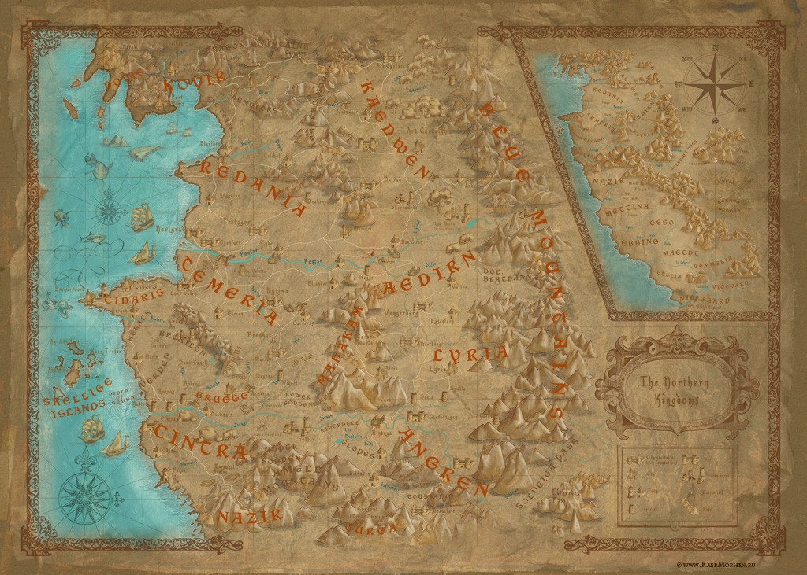

# Мир «Ведьмака».

Вымышленная вселенная, созданная польским писателем Анджеем Сапковским. Описана в саге о Ведьмаке, состоящей из семи книг и нескольких отдельных рассказов. По мотивам произведений были созданы сериал, рок-опера и компьютерные игры.

