Кратко о статье: Для многих из нас «Волшебник Изумрудного города» и другие повести Александра Волкова стали первым глотком фэнтези — еще тогда, когда мы и слова такого не знали. «Мир фантастики» приглашает вас вспомнить детство и еще раз прогуляться по дороге из желтого кирпича.

## Вечная сказка

# Волшебник Изумрудного города

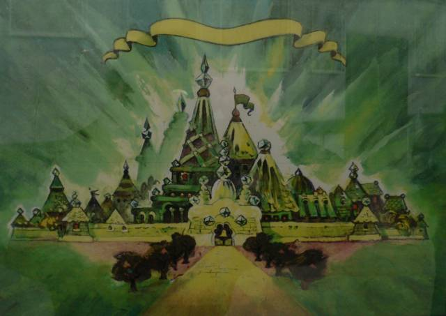

> — Послушай ты, малыш, все, что тут написано про Элли и ее приятелей, правда 
> или выдумка? Уж очень все это похоже на сказку!
>
> — Все это чистая правда, госпожа, клянусь жизнью моих внуков! Да это что, 
> читайте дальше, там вы найдете еще более удивительные вещи.
>
> *Александр Волков, “Желтый туман”*

|               |                                                       |
|---------------|-------------------------------------------------------|
|Название мира: |Страна Оз, Волшебная страна                            |
|Возникновение: |1900 год новой эры нашего мира                         |
|Создатели:     |Л. Фрэнк Баум, Александр Волков, Леонид Владимирский   |
|Происхождение: |литература                                             |
|Проявления:    |фильмы, мультфильмы, настольные и видеоигры, спектакли |

Для нас — миллионов людей во всех уголках бывшего Советского Союза — 
“Волшебник Изумрудного города” стал первым знакомством с миром фантастики. Мы 
вырастаем и очень быстро узнаем, что первым Волшебную страну придумал 
американец Лайам Фрэнк Баум, а приключения Элли, Страшилы и Железного 
Дровосека были призваны прежде всего не развлекать детей, а воспитывать из них 
строителей светлого коммунистического будущего. А потом проходит еще десяток 
лет — и мы подсовываем потрепанные томики Волкова уже своим детям, потому что 
эта история, подобно кэрролловской “Алисе” или сказкам Пушкина, не становится 
хуже со временем или со сменой политических режимов.

## Первый придворный летописец

Общеизвестная легенда гласит: однажды вечером Фрэнк Баум рассказывал детям 
сказку, сочиняя на ходу. Когда его спросили, куда, собственно, ураган принес 
маленькую Дороти, Баум посмотрел на ящик с алфавитным каталогом, где стояли 
карточки от буквы “O” до буквы “Z”, и сымпровизировал: “В страну Оз”. Вышедшая 
в 1900 году книга “Удивительный волшебник из страны Оз” стала фантастически 
популярной. Через три года появилась “Чудесная страна Оз”, а потом книги об 
Изумрудном городе — всего 14 томов — стали издаваться с завидной регулярностью 
вплоть до самой смерти писателя. Эстафету подхватили другие авторы, в том 
числе художник Баума Джон Нил, и в результате век спустя мы имеем полсотни 
официальных “озовских” повестей и немереное множество любительских “фанфиков”.

|   |
|---|
|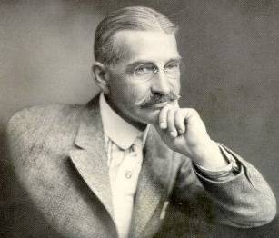|
|Л. Фрэнк Баум (1856-1919).|

Большим любителем Баума стал Рэй Брэдбери. Он очень метко заметил: в этих 
сказках — “сплошные сладкие булочки, мед и летние каникулы”, а “Алиса” 
Кэрролла по сравнению с ними — “остывшая каша, арифметика в шесть утра, 
обливания ледяной водой и долгие сидения за партой”. Нельзя не согласиться с 
признанным классиком, однако главное достоинство страны Оз — неудержимый полет 
авторской фантазии — становится заодно и основной слабостью книг Баума. Его 
сказочные повести построены по одной и той же схеме: главные герои попадают в 
затруднительные обстоятельства, преодолевают многочисленные затруднения и в 
конце концов вкушают заслуженный отдых в Изумрудном городе. Этакий вариант 
“квеста” в поисках Святого Грааля, совмещенный с американской мечтой для 
детей: будь хорошим, слушайся старших, исполняй законы — и тебя непременно 
примет в свои пушистые объятья беззаботная сказка. Интересно, что и Дороти с 
дядей и тетей, и сам волшебник Изумрудного города уже в первой половине 
сериала перебираются в страну Оз на постоянное поселение — и в этом можно 
углядеть своеобразный эскапизм.

|   |
|---|
|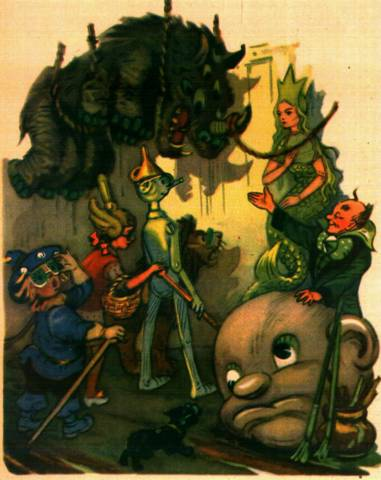|
|Многоликий волшебник Изумрудного города.|

> Когда ты подходишь к границе Страны Оз, то дальше уже ничего нет. Когда-то 
> вокруг нее была песчаная пустыня, но теперь все по-другому. Мы не видим 
> людей из Внешнего Мира, а они не видят нас.
>
> *Фрэнк Баум, “Лоскутушка из страны Оз”*

Сказочная вселенная Фрэнка Баума обширна и хаотична. Помимо собственно страны 
Оз, здесь имеется сопредельное государство Эв, подземное царство коварных 
гномов, еще целый ряд скрытых в земных недрах областей и даже туннель на ту 
сторону Земли, где обитают драконы и самый беспристрастный судья на планете. 
Нередко сама страна Оз, заботливо вынесенная в заглавие каждой книги, 
появляется только в самом конце и на несколько страниц. При этом Баум не 
стремится свести все им написанное в единый и непротиворечивый мир. Часто он 
даже не утруждает себя придумыванием имен: знакомые нам Гингема и Бастинда так 
и остаются у него Злыми Волшебницами Востока и Запада. И поэтому повести о 
стране Оз можно причислить к детской фантастике только с большой натяжкой. Уж 
скорее это авторские сказки.

### Порядок чтения

#### Книги Л. Фрэнка Баума

1. “Удивительный волшебник из страны Оз” (“The Wizard of Oz”, 1900)
1. “Страна Оз” (“The Land of Oz”, 1903)
1. “Озма из страны Оз” (“Ozma of Oz”, 1907)
1. “Дороти и Волшебник в стране Оз” (“Dorothy and the Wizard in Oz”, 1908)
1. “Путешествие в страну Оз” (“The Road to Oz”, 1909)
1. “Изумрудный город страны Оз” (“The Emerald City of Oz”, 1910)
1. “Лоскутушка из страны Оз” (“The Patchwork Girl of Oz”, 1913)
1. “Тик-Ток из страны Оз” (“Tik-Tok of Oz”, 1914)
1. “Страшила из страны Оз” (“The Scarecrow of Oz”, 1915)
1. “Ринкитинк в стране Оз” (“Rinkitink in Oz”, 1916)
1. “Пропавшая принцесса страны Оз” (“The Lost Princess of Oz”, 1917)
1. “Железный Дровосек из страны Оз” (“The Tin Woodman of Oz”, 1918)
1. “Волшебство страны Оз” (“The Magic of Oz”, 1919)
1. “Глинда из страны Оз” (“Glinda of Oz”, 1920)

#### Книги Александра Волкова

1. “Волшебник Изумрудного города” (1939)
1. “Урфин Джюс и его деревянные солдаты” (1963)
1. “Семь подземных королей” (1964)
1. “Огненный бог марранов” (1968)
1. “Желтый туман” (1970)
1. “Тайна заброшенного замка” (1975)

## За океаном

В Советском Союзе с “Удивительным волшебником из страны Оз” произошло то же 
самое, что и с “Пиноккио” Карло Коллоди: в 1939 году Александр Мелентьевич 
Волков (1891—1979) переписал сказку Баума, во многом сохранив сюжет и 
персонажей. “Волшебник Изумрудного города” стал не просто переводом 
американского писателя, а, без преувеличения, совершенно новой книгой, 
созданной для русского читателя. Даже самый хороший перевод вряд ли принес бы 
Изумрудному городу славу классической повести-сказки для детей, какими стали 
книги Волкова.

|   |
|---|
|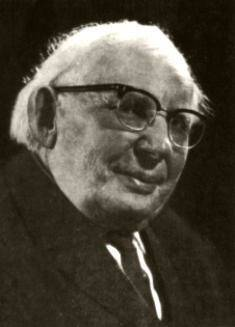|
|Александр Волков был переводчиком, математиком, писал исторические романы. Но всемирную популярность ему принесли шесть детских повестей.|

|   |
|---|
||
|Волков окружил Волшебную страну не только пустыней, но и Кругосветными горами.|

Если прочитать “Удивительного волшебника...” и “Волшебника Изумрудного города” 
одного за другим, становится очевидно: Волков как писатель стоит заметно выше 
Баума. Персонажи Волкова более объемны и ярки, он умеет одной-двумя фразами 
создать запоминающийся образ. Александр Мелентьевич не гнушается давать имена 
даже “проходным”, эпизодическим персонажам, таким, например, как кухарка во 
дворце Бастинды. Выстроенная Волковым картина мира выглядит куда более 
изящной, в чем несложно убедиться на одном примере.

|   |
|---|
|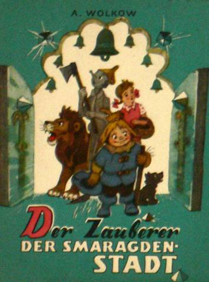 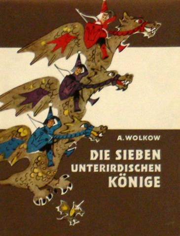|
|Книги Александра Волкова переведены на английский, немецкий и другие языки.|

> Дороти-Элли приземляется аккурат на злую колдунью, находит серебряные 
> башмачки и отправляется по дороге, вымощенной желтым кирпичом. Жевуны 
> принимают девочку за волшебницу. Правда, у Баума они объясняют это тем, что 
> на Дороти платье белого цвета, а белый — цвет чародеев. А жевунам Волкова 
> достаточно того, что Элли освободила их от Гингемы, — прозвище “Фея 
> Убивающего домика” прицепится к ней надолго. В Фиолетовой стране девочка 
> попадает в плен к другой колдунье, но та не может сделать ей ничего плохого. 
> Это все из-за того, что Дороти поцеловала добрая волшебница Севера, 
> объясняет Баум, и теперь всякое зло к девочке не липнет. Не надо множить 
> сущностей, отвечает Волков. Все просто: Элли защищают серебряные башмачки. И 
> это не единственный случай, когда Волков “оптимизирует” сюжет Баума, делая 
> его более насыщенным и связным.

|   |
|---|
|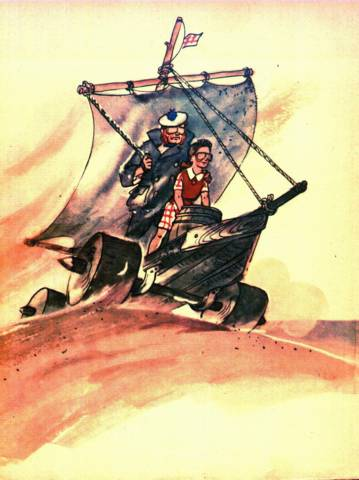|
|Техническая сметка и сила духа помогут преодолеть даже Великую пустыню.|

Что же касается пяти волковских продолжений, то они имеют к сказкам Баума и 
вовсе косвенное отношение. Если в стране Оз прослеживаются мотивы американской 
мечты и поисков Грааля, то у Волкова — начиная с “Урфина Джюса и его 
деревянных солдат” и заканчивая “Тайной заброшенного замка” — магистральная 
линия совершенно иная. Первая часть книги всегда описывает вставшую перед 
Волшебной страной угрозу и попытки местных жителей справиться с нею своими 
силами. Когда выясняется, что дело принимает серьезный оборот, приходится 
звать помощь из большого мира. Только в “Семи подземных королях” Элли и Фред 
Каннинг прибывают в Волшебную страну не по своей воле — зато как нельзя 
вовремя. Наконец, смекалка, а то и техническая мысль больших друзей Страшилы и 
Железного Дровосека освобождают народ от власти очередного тирана.

Похожий сценарий повторяется пять раз, но на читательский интерес это почти не 
влияет. Во-первых, масштабы постоянно меняются. В “Урфине Джюсе” Элли и Чарли 
Блек боролись с деревянными солдатами. В “Семи подземных королях” герои 
избавили рудокопов от феодальных пережитков. “Огненный бог марранов” — о 
грязной политике и манипуляции массами, Джюс здесь немного напоминает великого 
демагога Гитлера. “Желтый туман” — самая настоящая экологическая катастрофа. 
Ну а в “Тайне заброшенного замка” угроза порабощения встает перед всей нашей 
планетой. Во-вторых, Волков оставляет неизменными декорации и главных героев, 
зато с каждым разом рассказывает что-то новое об уже знакомой Волшебной 
стране. Развитие мира идет не вширь, как у Баума, а вглубь. В итоге мы 
получаем не массу разрозненных книг, а единую, цельную, проработанную 
вселенную.
	
|   |
|---|
|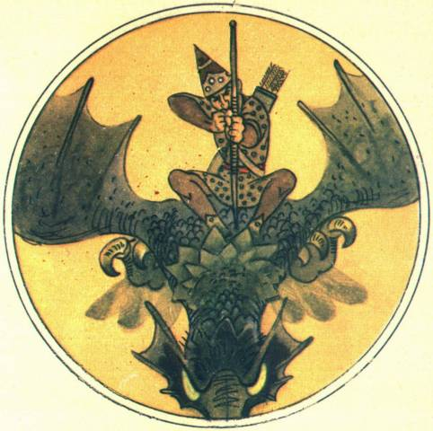|
|Подземные рудокопы свято хранят неприкосновенность своей бессолнечной страны.|

### “Будем путешествовать вместе”

 

Вот уже много лет повести Александра Волкова выходят с классическими 
иллюстрациями Леонида Владимирского. Леонид Викторович — старейший художник 
детской книги, автор знаменитого Буратино в полосатом колпачке — в сентябре 
этого года отпраздновал 85-летие. “Мир фантастики” воспользовался случаем и 
задал несколько вопросов художнику.

**Как начали работать с Волковым?**

В 1956 году я закончил “Приключения Буратино” и стал искать интересную книгу, 
чтобы над ней работать. Пришел в библиотеку, и мне дали старое издание 
“Волшебника Изумрудного города” с иллюстрациями Радлова. Радлов был журнальным 
художником-юмористом, оно оформлял книгу еще для первого издания, в 1939. У 
него были очень хорошие рисунки, но черно-белые. А детям нужны цвета. Я 
разыскал Волкова и начал работать над его сказкой.

Когда три года спустя вышло первое издание с моими иллюстрациями, оно имело 
большой успех. Читатели стали требовать от Волкова продолжения. И мы стали 
работать вместе: он писал, а я рисовал.

**Приходилось ли подсказывать что-то Волкову, помогать ему с книгами?**

По большому счету, нет: Волков и без меня интересно, хорошо писал. Разве что 
мелочи: цвет одежды, какие-то небольшие детали. Хотя вот подземных королей 
Волков сначала задумал двенадцать. Уже закончил рукопись, а я ему говорю: 
“Давайте сделаем семь, по цветам радуги”. Волков покряхтел, но переделал.

И еще у него была такая проблема: герои постоянно ходили не в тех 
направлениях. Поэтому я нарисовал по его указаниям карту Волшебной страны, 
чтобы путешествовали по карте. Правда, тут тоже интересно получилось: у Баума 
Дороти шла с востока на запад, а у Волкова Элли — наоборот, с запада на 
восток. Наверное, чтобы непохоже было, он так сделал.

**Чьи книги вам больше нравятся: Волкова или Баума?**

Волкова, конечно. Они добрее, у них есть цель — помочь в беде. Они более наши. 
У Баума много придумок, он сыпет новыми и новыми персонажами и приключениями. 
Это становится утомительно, начинаешь путаться. У Баума все книги отдельно, а 
у Волкова — единая линия. И еще Волков ввел Людоеда — а этот персонаж играет 
важную роль в моей книжке “Буратино в Изумрудном городе”.

**А что можете сказать про новые продолжения Сергея Сухинова?**

Они мне интересны, но Сухинов сам признает, что продолжает скорее не Волкова, 
а Баума. Для меня важен общий сюжет, связь всех картин, а у Сухинова, по сути, 
отдельные рассказы. Мне случалось слышать, что мое продолжение по стилю, 
манере письма больше похоже на Волкова, а сухиновские — на Баума.

|   |
|---|
|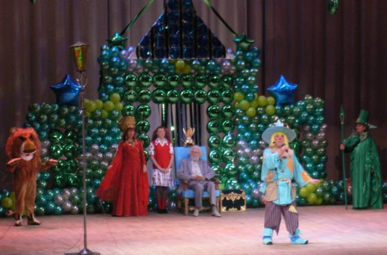|
|85-летие Л. Владимирского отмечали в московском дворце пионеров на Воробьевых горах.|

**Были ли у Волкова какие-то планы об Изумрудном городе, которые он не успел 
завершить?**

Когда Волков закончил “Тайну заброшенного замка”, он сказал мне наполовину в 
шутку: “А теперь мы с вами, писатель и художник, вдвоем отправимся в Волшебную 
страну. Будем путешествовать вместе”. Но — видимо, так и не успел ничего 
написать.

**Спасибо! Долгих и творческих лет жизни!**

Можно сказать, что слова Волкова частично сбылись: в 1996 году вышла сказка 
Леонида Владимирского “Буратино в Изумрудном городе”, где он сводит своих 
любимых персонажей — Буратино и Страшилу Мудрого. А на праздновании юбилея 
художника и писателя Леонид Викторович вышел на сцену и оказался в окружении 
сказочных персонажей, которых он вот уже полвека рисует для каждого из нас.

## Новая жизнь волшеной страны

Конечно, сейчас Изумрудному городу далеко до популярности Поттерианы, зато 
мало какая современная сказка может похвастаться стабильным интересом публики 
в течение более сотни лет. Первые экранизации книг о стране Оз появились еще 
при жизни Фрэнка Баума, мало того, сам писатель участвовал в создании фильмов 
и даже учредил собственную студию для съемок. Впрочем, классическим стал 
снятый в 1939 мюзикл “Волшебник из страны Оз” с Джуди Гарланд в роли Дороти. 
Появившиеся там Страшила, Железный Дровосек, Трусливый Лев стали образцами для 
изображения этих персонажей на Западе. Общее число кинолент по мотивам сказок 
Баума переваливает за сотню. Японцы сняли несколько “озовских” аниме-сериалов, 
в том числе 52-серийный “Озу-но махоцукай”. В строительстве 
кинематографического Изумрудного города замечены наша страна, Испания, 
Бразилия, даже Турция. Последняя на 2005 год экранизация — “Волшебник”, 
исполненный героями “Маппет-шоу”.

|   |
|---|
|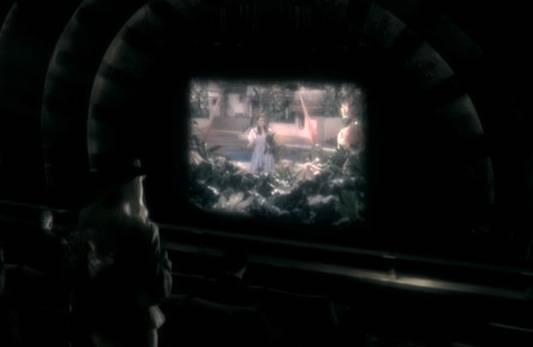 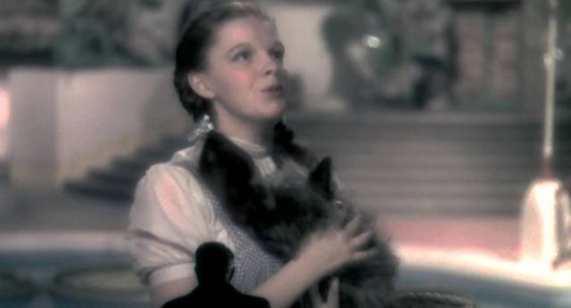|
|Доктор Дженнингс пригласил Полли Перкинс (фильм "Небесный Капитан и Мир Будущего") именно на мюзикл "Волшебник из страны Оз" 1939 года.|

|   |
|---|
|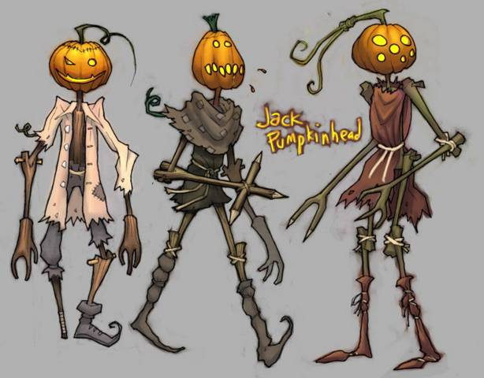|
|Тыквоголовый Джек: "Узнаю брата Макги!". Концепт-арт к "American McGee's Oz".|

С игровой составляющей Изумрудному городу везет куда меньше. Первая настолка 
по стране Оз появилась еще в двадцатых годах прошлого века, и с тех пор новые 
игры выходят каждые лет пять, но вот предназначены они, как правило, для 
семейного досуга и не особо выделяются среди множества подобных. В девяностых 
вышла пара консольных видеоигр “Волшебник из страны Оз”, а три года назад 
знаменитый Американ Макги объявил о том, что собирается сделать “American 
McGee’s Oz”, однако, судя по всему, ему не удалось заинтересовать издателей, и 
проект находится в подвешенном состоянии.

|   |
|---|
|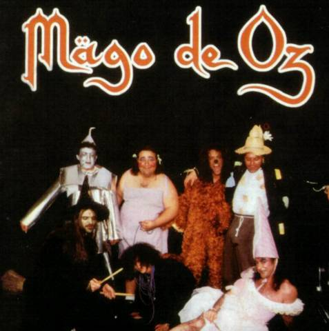|
|Испанская фолк-металлическая группа "Mago de Oz". Вряд ли Баум думал о чем-то похожем.|

Из отечественных экранизаций “Волшебника Изумрудного города” можно назвать 
две. Первая — 10-серийный кукольный мультфильм 1974 года, запоминающийся 
песней “Мы в город Изумрудный идем дорогой трудной”. И вторая — снятая в 1994 
году игровая лента, которая, к сожалению, не поднялась выше уровня 
невыразительной малобюджетки. Зато “Волшебник Изумрудного города” идет на 
сцене каждого второго детского театра в России. Редкое фантастическое 
произведение может похвастаться чем-то подобным.

За последние десять лет в России появилась 21 новая сказка о Волшебной стране. 
Об одной из них — “Буратино в Изумрудном городе” — мы беседовали с ее автором 
Леонидом Владимирским (см. врезку), а остальные двадцать принадлежат перу 
фантаста Сергея Сухинова (наиболее известен по сериалу о Звездном волке 
Моргане Чейне). Два сухиновских сериала — “Изумрудный город” (1997—2004) и 
“Сказки Изумрудного города” (2000—2001) — состоят из небольших историй, 
которые слабо связаны между собой и с книгами самого Волкова, а местами и 
открыто противоречат последним. Кроме того, Сухинов нередко скатывается в 
неприкрытое морализаторство — а ведь к такому не прибегал даже творивший в 
советские времена Волков. Эти новейшие серии можно порекомендовать только 
заядлым поклонникам Изумрудного города, если такие найдутся.

|   |
|---|
|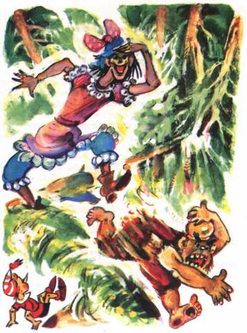|
|В своем продолжении Л. Владимирский попытался обвенчать Людоеда и колдунью Арахну. Было шумно и весело.|

### Изумрудный интернет

* emeraldcity.ru — главный ресурс рунета об Изумрудном городе.
* vladimirsky.worldfriends.ru — официальная интернет-страница Леонида 
  Владимирского.
* wizardoz.narod.ru — фан-сайт, посвященный книгам Баума и Волкова.
* ozclub.org — международный клуб “Волшебника из страны Оз” (действует с 1957 
  года).

----

Изумрудный город объединил два мира, настолько же похожих, насколько и 
разных, — Волшебную страну Александра Волкова и Оз Фрэнка Баума. Оба приобрели 
головокружительную известность, оба так и остались детскими сказками, не сумев 
выйти в большую фантастику. Можно сказать, что “Волшебник Изумрудного 
города” — это русский “Хоббит”, за которым не последовало “Властелина колец”.

И вместе с тем влияние книг Волкова на современную фантастику огромно — только 
подумать, скольких людей они подтолкнули к поискам чудесного. “Волшебник 
Изумрудного города” — это и “несуществовавшее” советское фэнтези, хотя 
волшебные книги, летучие обезьяны и деревянные солдаты соседствуют здесь с 
наукой, инопланетянами и боевыми роботами. Это и одна из разновидностей 
популярного нынче поджанра “современный человек проваливается в иной мир”. Это 
и фантастика “затерянных миров”, подробнее о которой мы расскажем в следующем 
“МФ”. Ну и наконец, это просто замечательная детская литература, пройти мимо 
которой не должен ни один настоящий поклонник хорошей фантастики.
