# Земноморье Урсулы Ле Гуин: мир магии и живых людей

> Свет — рука левая тьмы,
> 
> Тьма — рука правая света.
> 
> Двое — в одном, жизнь и смерть.
> 
> *Урсула Ле Гуин, «Левая рука тьмы»*

|               |                               |
|---------------|-------------------------------|
|Название мира: |Земноморье                     |
|Возникновение: |1964 год новой эры нашего мира |
|Создатель:     |Урсула Ле Гуин                 |
|Происхождение: |Литература                     |
|Воплощения:    |Телефильм, аниме               |

> Цикл книг Урсулы Ле Гуин о Земноморье — одна из жемчужин мирового фэнтези. 
> Писательнице удалось создать убедительный, проработанный до мельчайших 
> деталей мир, основанный на магии, которая похожа на науку. Мир, населенный
> яркими персонажами, которые ведут себя подобно живым людям, а не как бездушно
> смоделированные схемы.

Произведения о Земноморье распадаются на два блока. В центре основной
трилогии — история самого могучего волшебника Архипелага Геда, его
нравственного и идейного становления: от самонадеянного юнца до умудренного
горьким опытом мага. В остальных произведениях Гед отходит на второй план,
иногда исчезая совсем, и рассказано в них о различных событиях из истории
Земноморья.

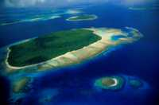

## В начале времён

О сотворении Земноморья, мира тысячи островов, повествует древнейший эпос 
«Создание Эа» — основа образования жителей Архипелага. В нем говорится, что в 
начале времен Сегой поднял острова Земноморья со дна морского, дав каждому 
предмету и живому существу имя на Языке Созидания. Ученые и маги до сих пор 
спорят о личности Сегоя. Кто он? Возможно, персонифицированная Древняя Сила 
Земли? Известно лишь, что это имя — древнейшее обращение, близкое к понятию 
«Созидатель».

> ### Хроники Земноморья
> * «Волшебник Земноморья» (A Wizard of Earthsea, 1968)
> * «Гробницы Атуана» (The Tombs of Atuan, 1971)
> * «На последнем берегу» (The Farthest Shore, 1972)
> * «Техану» (Tehanu, 1990)
> * «Сказания Земноморья» (Tales from Earthsea, 2001)
> * «На иных ветрах» (The Other Wind, 2001)

## Магия Архипелага

Среди обитателей Земноморья способность к магии часто бывает врожденной. Дар 
усиливается за счет использования Истинной Речи, или драконьего Языка 
Созидания, в котором название каждой вещи отражает ее суть. Все магические 
заклинания содержат минимум одно слово Истинной Речи, а Великие Заклятия 
целиком составляются на ней.

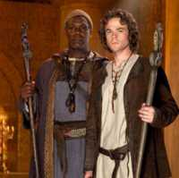

Магу без посоха не жить

Изучение магии заключается в освоении Истинной Речи, слова которой маги узнают
от своих учителей. Колдуны и ведьмы обычно способны запомнить лишь несколько
слов Языка, волшебники знают их довольно много, а некоторые даже свободно
говорят на нем. Особо одаренные волшебники или люди, находящиеся в родстве с
драконами, обладают врожденным знанием Истинной Речи.

Признак магического мастерства — способность узнавать Истинные имена вещей.
Подлинное имя человека — также одно из слов Истинной Речи, и любой, кто узнает
его, обретает власть над носителем. Поэтому Истинного имени не знает никто,
кроме того, кто его носит, и того, кто это имя дал. Имя дается человеку в
ранней юности и в определенном месте, обязательно у воды. Люди и драконы
тщательно хранят тайну Истинного имени, а волшебники защищают их с помощью
заклятий.

Для сохранения Истинной Речи волшебники Земноморья создали руническое письмо,
знаки которого являются магическими заклинаниями. Написать такую Руну или
произнести ее вслух способен только маг, прошедший специальное обучение.
Великий чародей Атх составил «Книгу Имен», в которой объединил разрозненные
магические знания об Истинной Речи. Этот фундамент волшебного искусства
хранится в Одинокой Башне на острове Рок.

Если человек говорит на Языке Созидания или пишет с помощью Истинных Рун — это
полная гарантия правдивости его утверждений. Люди не способны лгать, используя
Язык, а вот драконы могут.

## Драконы Земноморья

Драконы в Земноморье существовали задолго до появления людей, которые называли
их Перворожденными или Старейшими. По легендам, драконы и люди некогда были
единым народом, но постепенно произошло Разделение рас. Люди расселились на
центральных и восточных островах Архипелага, а драконы — на самых дальних
клочках суши Западного Предела. От самого рождения драконы владеют Истинной
Речью, будучи, по сути своей, магическими существами.

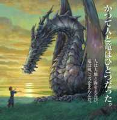

Человек и дракон (аниме «Сказания Земноморья»)

Большую часть жизни драконы проводят в воздухе. На скалистые острова они
спускаются лишь для создания гнезда, где самка откладывает яйца и выводит
потомство. Воду драконы ненавидят и мгновенно тонут, стоит им случайно
оказаться в море. Легенды гласят, что питаются драконы солнечным светом или
огнем, а убивают, только придя в ярость, защищая потомство или ради
развлечения, при этом добычу никогда не съедают. Но доподлинно об этом не знает
никто.

Из людей только волшебники иногда могут противостоять дракону, хотя случается
это редко. Обычно драконы побеждают волшебников-людей, ибо, пользуясь Истинной
Речью, способны лгать. Но самые великие маги, вроде Геда, способны успешно
противостоять Перворожденным.

> ### Создательница Земноморья
> Урсула Крёбер Ле Гуин родилась 21 октября 1929 в Беркли, штат Калифорния, в
> семье Крёберов — известного антрополога Альфреда и писательницы Теодоры.
> Училась в Колумбийском университете (специальность — средневековая романская
> литература). Во время работы во Франции познакомилась с историком Шарлем Ле
> Гуином, за которого вышла замуж в 1953, у них две дочери и сын. Фантастику
> пишет с начала шестидесятых, лауреат многих престижных премий. Творчество Ле
> Гуин характерно повышенным интересом к проблемам социологии, антропологии,
> психологии, взаимодействии различных культур, философии.
>
> Писательница умерла 22 января 2018 года в возрасте 88 лет.
>
> 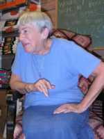

## География и народы

Земноморье — архипелаг из сотен островов, со всех концов окруженных морями.
Центр цивилизации — наиболее крупные острова Внутреннего моря, где царят
наследственные лорды. А всем Архипелагом формально правят короли, но реальная
власть находится в руках купеческих и ремесленных гильдий. В Земноморье
отсутствует официальная религия, хотя люди придерживаются древних ритуалов
вроде исполнения легенд и песен. На небольших островах поклоняются Древним
Силам Земли, но без фанатизма.

Обитатели Архипелага говорят на диалектах ардического языка и обладают сходной
культурой. Большая часть жителей Земноморья — люди смуглые, с коричневой кожей,
прямыми черными волосами и темными глазами, невысокие, но физически крепкие. У
жителей северных островов более светлый цвет кожи, среди них встречаются
блондины. Язык и культура также отличаются — немудрено, ведь северяне долгое
время находились под властью каргов.

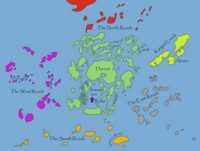

Карта Земноморья

### Карги

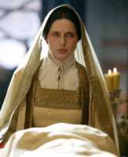

И эта милая тетенька — каргадская Верховная жрица?

Племена каргов обитают на четырех крупных островах, расположенных к
северо-востоку от основного Архипелага. У каргов преобладает светлый цвет кожи,
голубые и зеленые глаза, русые или белые волосы. Каргадский язык сильно
отличается от ардического, хоть и имеет общие корни. История Каргадских
островов — цикл бесконечных междоусобиц, в которых сформировался весьма
воинственный народ. Типичные черты их общества — рабовладение, строгая кастовая
система и неравенство полов.

Магия среди каргов — явление редкое. Поэтому отношение к ней презрительное,
даже враждебное, что, возможно, объясняет неоднократные попытки каргов добиться
превосходства над жителями остального Архипелага с помощью оружия.

Карги поклоняются воплощенным Древним Силам Земли, их главное святилище —
гигантская пещера Гробницы Атуана. Столица каргов — Гупун, но реальная власть
исходит из священного города Авабатха, где находится резиденция Верховного
Жреца. Со временем один из жрецов назвал себя живым воплощением Небесного
Отца — Бого-Королем — и принял титул Императора Каргада.

Торговый город Хорт (аниме «Сказания Земноморья»). Тут любят торговать рабами

Хроники Земноморья Легенды Архипелага: Земноморье Урсулы Ле Гуин 2
Всё в одной книге

«Волшебник Земноморья» (A Wizard of Earthsea, 1968)
«Гробницы Атуана» (The Tombs of Atuan, 1971)
«На последнем берегу» (The Farthest Shore, 1972)
«Техану» (Tehanu, 1990)
«Сказания Земноморья» (Tales from Earthsea, 2001)
«На иных ветрах» (The Other Wind, 2001)

## История островов

### Эпоха королей

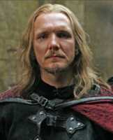

Король Земноморья. Увы, не Морред

Первыми королями Земноморья были лорды острова Энлад, которые силой и магией
стали властителями почти всего Архипелага. Величайший из королей Морред
происходил из семьи волшебников и унаследовал трон, когда пресеклась основная
династия. Однажды на острове Солея молодой монарх повстречал прекрасную
Эльфарран. В знак любви он подарил ей серебряный браслет с могущественной Руной
Мира. Морред и Эльфарран поженились, и в их правление были заложены основы
современной культуры и государственности Островов.

Однако у Эльфарран был давний поклонник, которого она отвергла, — обидчивый
маг, чье имя не сохранилось. Под воздействием его чар подданные Морреда начали
творить всяческие бесчинства. Морред вступил в борьбу со злодеем и настиг мага
за морем Эа, где оба погибли в схватке. Но перед смертью злодей поднял
гигантскую волну, которая накрыла остров Солея, где находилась Эльфарран. В
общем, все умерли…

Через 150 лет после гибели Морреда король Акамбар перенес столицу Архипелага
на Хавнор, который был идеальным торговым и военным центром. Так начался
неспокойный период хавнорских королей, большую часть которого Земноморье
подвергалось набегам каргов и налетам драконов.

### Подвиги Эррет-Акбе

Последним истинным королем Архипелага был Махарион Илиенский, чьим магом,
советником и лучшим другом состоял сын деревенской колдуньи Эррет-Акбе —
самый прославленный герой Архипелага. Махарион и Эррет-Акбе десять лет
сражались с каргами, которые пытались захватить богатые Внутренние острова. Во
время нашествия врагов на остров Уэй Эррет-Акбе превратил всю воду на нем в
бурный поток, который смыл захватчиков в море. Это тяжкое поражение на время
приостановило экспансию Каргада.

Воспользовавшись случаем, Махарион отправил Эррет-Акбе в Каргад, дабы заключить
мир. Для этого королева-мать Геру передала магу фамильную реликвию —
серебряный браслет с Руной Мира. Каргадский король Торег был не прочь
замириться с Махарионом. Однако Верховный жрец Интатин этого не хотел и вызвал
Эррет-Акбе на поединок, сумев завлечь мага в место, где Древние Силы Земли
парализовали его чары. Во время битвы браслет с Руной Мира был сломан — у мага
осталась только его половина. От гибели героя спасла каргадская принцесса, за
что Эррет-Акбе подарил ей половинку браслета. Жрец Интатин тоже сохранил часть
браслета, или Кольца, как его стали называть, которую передал в Великую
Сокровищницу Гробниц Атуана…

> После установления власти Бого-Королей потомки светской династии были сосланы на необитаемый островок. Принцесса Антиль увезла с собой половинку сломанного Кольца Мира и много лет спустя подарила ее волшебнику Геду. Позднее Гед сумел соединить половинки сломанного Кольца и восстановить Руну Мира. Доставленное в Хавнор Кольцо дождалось там нового истинного Короля Земноморья Лебаннена.

Когда Эррет-Акбе вернулся в Хавнор, над столицей появился Великий Дракон Орм, и маг, также обратившись в дракона, вступил с ним в бой. Однако после хорошей драки они разговорились и решили уладить дело полюбовно. Тем временем войско под началом магов налетело на драконьи гнезда и перебило тучу детенышей. Битва Эррет-Акбе и Орма возобновилось, пока оба не умерли от ран на острове Селидор. Махарион пережил Эррет-Акбе всего на несколько лет. Смертельно раненый в битве, король изрек знаменитое пророчество:

«Тот унаследует мой трон, кто живым пройдет по темному царству смерти и выйдет к дальнему берегу дня».

### Тёмные времена и возвышение волшебников

После смерти Махариона Архипелаг превратился в поле сражений феодальных князей, правителей городов и пиратских атаманов. Волшебники активно торговали своим искусством, из-за чего магия стала пользоваться в народе дурной славой. Однако были и волшебники-патриоты, которые на острове Рок сформировали «Братство Руки», чьей заботой стали проблемы магической этики и обучения волшебству. Затем несколько сильнейших магов основали на Роке Школу — центр сбора и распространения магических знаний. Благодаря волшебникам Рока магия Земноморья постепенно оформилась в систему знаний, фактически в науку, причем основанную на моральных и этических законах. Выпускники Школы повсюду противостояли беззаконию, пиратству и усобицам. Они налагали штрафы, помогали заключать экономические и военные соглашения, укрепляли границы.

Так маги превратились в главную силу Земноморья.

Легенды Архипелага: Земноморье Урсулы Ле Гуин 19
Школа Рока на обложке «Волшебника Земноморья»

Пока Королевский трон в Хавноре пустовал, Школа Рока взяла на себя управление Архипелагом. Самый могучий волшебник Школы становился Верховным Магом Земноморья, чья власть во многом соответствовала королевской. Элита Школы состояла из девяти Мастеров, которые обучали учеников разным премудростям. В их число входили Ветродуй (управление погодой), Ловкая Рука (создание иллюзий), Травник (травология и медицина), Метаморфоз (трансформация тел и предметов), Заклинатель (сотворение Великих Заклятий), Ономатет (изучение Истинной Речи), Путеводитель (распознавание подлинных намерений и замыслов), Искатель (поиск пропавших людей и предметов) и Привратник (охранитель входа в Школу).

Чуть позже первый Верховный Маг Халькель заменил Искателя на Мастера Регента, который занимался преподаванием героического эпоса и песенных заклинаний. Верховный Маг был десятым Мастером Школы, воплощая жизненную, этическую и интеллектуальную силу Рока, при этом обладая значительной политической властью. Придумавший этот титул Халькель установил строжайшую магическую иерархию, согласно которой обучение в Школе женщин было запрещено. На их долю осталось лишь ведовство, которое стало называться «низшим ремеслом».

Мальчик, проявивший магический талант и посланный на Рок, должен был изучить основы высших искусств и получить диплом колдуна. Если он преуспевал в науках, то мог продолжить свое обучение, совершенствуясь в изучении Истинной Речи, после чего становился волшебником и получал посох — символ магических умений и навыков.

## Самый великий маг

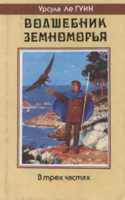

Однажды на острове Гонт у деревенского кузнеца родился сын Дьюни. Мать его умерла рано, отцу было недосуг, поэтому рос Дьюни, как придется. Его тетка, деревенская колдунья, обнаружила в пареньке недюжинную магическую силу. А потом на деревню напали пираты-карги, на которых Дьюни напустил густой туман, из-за чего многие захватчики погибли.

Не рассчитав сил, парень едва не умер, однако его спас маг Огион Молчаливый. Он взял мальчика себе в ученики и дал ему Истинное Имя — Гед. А мир знал Геда как Ястреба (или Перепелятника) — из-за его способности повелевать птицами и крючковатого носа, похожего на клюв. Гед был излишне горд и нетерпелив: вместо постепенного познания волшебной мудрости он пытался проникнуть в суть могучих древних заклинаний разом. Огион вновь выручил Геда от опасности погружения во тьму, после чего отослал его в Школу острова Рок.

Там Гед быстро стал лучшим учеником, отчего самонадеянность юноши возросла. Подзуживаемый товарищами, он попытался вызвать из Царства Смерти душу королевы Эльфарран, но неудачно, открыв дорогу в мир живых страшной призрачной Тени. От гибели Геда ценой своей жизни спас Верховный Маг Неммерль. Но уничтожить Тень был способен лишь сам Гед, для чего надо было знать Истинное Имя врага. Страшась призрака, Гед покинул Рок. После ряда опасных приключений молодой маг обрел волю к борьбе и отправился в погоню за Тенью. В Открытом море, за гранью известного мира, Гед наконец настиг врага и прозрел истину. Оказывается, Тень — всего лишь темная сторона его души!

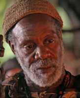
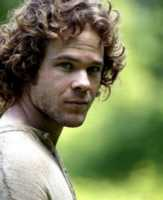

> «Гед протянул к ней руки, выронил посох и крепко схватил ее — ту черную часть собственного «я», которая тянулась ему навстречу. Свет и тьма встретились, соединились, слились воедино».

После победы Гед возвращается домой и вскоре становится Верховным Магом. Об этом повествует «Волшебник Земноморья».

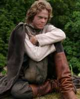
Гед: уже потрёпанный жизнью маг (аниме «Сказания Земноморья»)

Во второй книге, «Гробницы Атуана» рассказано об одном из величайших подвигов Геда. Маг тайно проник в святыню каргов, дабы разыскать Кольцо Эррет-Акбе, без которого невозможно объединить Земноморье. Во время блужданий в подземном лабиринте Гед знакомится с юной жрицей Тенар, которая помогает ему, безоглядно влюбившись в молодого мага.

В заключительном романе трилогии, «На последнем берегу», Гед с огромным трудом побеждает безумного волшебника, который, возжаждав бессмертия, открыл врата между миром живых и мертвых. Путешествие в мир Смерти и спасение Земноморья дорого обошлись Геду, почти лишившемуся магической силы. Зато Земноморье вновь обрело Короля…

> ### Земноморье в кино Земноморье Урсулы Ле Гуин: мир магии и живых людей
>
> Книги о Земноморье дважды экранизированы. 13—14 декабря 2004 на Sci-Fi Channel состоялась премьера американского минисериала «Легенда Земноморья» (Legend of Earthsea) студий Hallmark Entertainment и Bender-Brown Productions. По сценарию Гэвина Скотта ленту поставил Роберт Либерман. В фильме снимались Шон Эшмор (Гед), Кристина Крейк (Тенар), Дэнни Гловер (Огион), Изабелла Росселлини (жрица Тар), Себастьян Роуч (король Тигат).
>
> В основу положен роман «Волшебник Земноморья», от которого, правда, в картине мало что сохранилось. Интересное, философски насыщенное произведение превратилось в невнятный гибрид «Властелина Колец» и «Гарри Поттера». Ле Гуин очень резко высказывалась по поводу этой экранизации. Ее главные претензии касались изменения характеров героев, выхолащивания серьезных философских идей книги и превращения фильма в беззубое семейное политкорректное приключение.
>
> В августе 2006 года на экраны Японии вышло полнометражное аниме студии Ghibli «Сказания Земноморья» (Gedo Senki) режиссера Горо Миядзаки. Ле Гуин высоко оценила художественность и образность картины, однако её расстроила чрезмерная жестокость. Также она раскритиковала изменённую мораль — в аниме злодея просто убивают, что противоречит всему замыслу книги. От критиков фильм получил смешанные отзывы.
>
>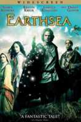

## Женщина — всему голова!

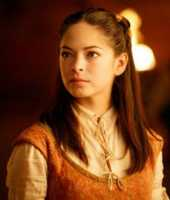

Как можно бросить такую красотку? Не будь лопухом, Гед!

Спустя годы Ле Гуин решила завершить эпос про Земноморье. Так появился роман «Техану: последняя книга Земноморья», в котором отражен мировоззренческий сдвиг Ле Гуин: писательница прониклась феминистическими идеями, хоть и не излишне рьяно.

Бывшая жрица Тенар была оставлена Гедом на его родном острове Гонт, где вышла замуж за местного фермера. У них пошли детишки, и Тенар вроде бы обрела счастье. Однако спустя годы ее муж умер, дети разбрелись кто куда, а женщина вновь оказалась в одиночестве. Правда, к ней попала загадочная одноглазая девочка Ферру, и стали они жить вместе. А позже дракон принес на остров утратившего магическую силу Геда.

Бывшему чародею пришлось учиться жизни, чтобы заново обрести ее смысл — жалкий удел для великого мага! В конце концов Тенар милостиво принимает некогда отвергшего ее великого мага под свое нежное крыло. Но это был еще не конец…

> Когда вышла «Техану», я дала ей подзаголовок «Последняя Книга Земноморья».
> Как я ошибалась! Со временем многие вещи в Земноморье начали волновать меня —
> должны ли волшебники блюсти целибат, и почему нет женщин на острове Рок, и кто
> такие драконы, и куда уходят люди Каргада после смерти? Я нашла ответы на
> многие из этих вопросов в историях, которые составляют «Сказания Земноморья».
> И я была готова рассказать, кто такая Техану, и кто такие драконы в романе
> «На иных ветрах».
>
> *Урсула Ле Гуин*
