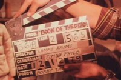
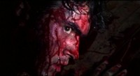
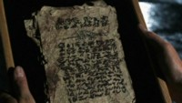
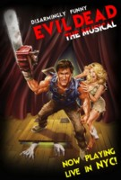
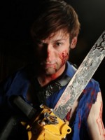
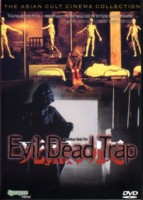
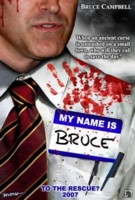

# Главное - у кого ружье!

> Я считаю, что мой главный долг — развлекать людей. Каждый новый фильм мне 
> хочется сделать немного другим... Речь идет не о профессиональном росте. Я
> говорю о том, что зрители постоянно хотят чего-то другого... Того, что пришло
> в наш мир не отсюда...
>
> Сэм Рэйми

> Чтобы обрести популярность, фантастическая история вовсе не должна быть 
> новой, умной и уж тем более вменяемой. Примеров тому множество. Скажем, 
> постмодернисты занимаются высокохудожественным плагиатом и издаются
> многотысячными тиражами, управление колобком, пожирающим таблетки в
> лабиринте, называется «культовой игрой», а фильмы Дэвида Линча понимают лишь
> маленькие зеленые гномики, живущие у него в волосах. Чтобы сделать
> заурядность шедевром, нужно просто знать меру в эксцентричности, уметь
> превращать банальности в неповторимый стиль и быть при этом гением.

27 лет назад братья Рэйми сотоварищи сделали нечто, за что им никогда не будет
стыдно, а конкурентам всегда будет мучительно больно. Слова «зловещие» и
«мертвецы» стали неотделимы друг от друга примерно так же, как «звездные» и
«войны». 20-летние американские подростки не просто качественно подурачились с
кинокамерой, но, сами о том не подозревая, создали целую вселенную ужаса.
Довольно забавную вселенную, надо сказать.

## Зловещая косология

|   |
|---|
||
|«Хлопушка» с рабочим названием первой части — «Книга мертвых».|

Термин «вселенная» может быть применен к фильмам ужасов лишь с некоторыми 
оговорками. Эта калька с английского universe по-русски звучит слишком 
астрономично, чтобы уживаться с волшебными и сверхъестественными сюжетами 
(пусть даже очень масштабными). Еще есть слово «мир», но употребить его в 
отношении историй, где пьют кровь и едят мозги, не смог бы даже самый 
закоренелый оптимист.

Мода называть подробно расписанные сюжеты «вселенными» появилась совсем 
недавно. Раньше никто бы и не задумывался о вселенной «Гостьи из будущего» или 
«Пикника на обочине». И даже сегодня сложно говорить об отдельных мирах 
«ужастиков». В 9 случаях из 10 все страшные истории происходят на фоне 
обыденной действительности. Их паранормальная составляющая объясняется «на 
пальцах», потусторонние измерения описываются как... «потусторонние измерения»,
а победа добра неизменно ведет к восстановлению «нормальности» окружающего
мира.

|   |
|---|
||
|Мы не можем похоронить Шелли! Она... она — наш друг!|

Бывают и исключения. Сюжеты о вампирах иногда уточняют историю и нравы
кровососов. Демонов можно назвать «кенобитами» и порадовать зрителей
обрывочными сведениями о «запредельном измерении неописуемых наслаждений».
Однако если речь идет об оживших мертвецах, дело совсем плохо. В лучшем случае
вину свалят на вирус, в худшем — на химическое оружие, а если и это не
поможет — на сценариста.

Рэйми не предполагал, что «Зловещие мертвецы» станут культовым фильмом. По
большому счету, он хотел просто развлечься. А в начале 1980-х особой
популярностью пользовались слэшеры (законодателем мод был «Хэллоуин») и
итальянские зомби-демонические «ужастики». Рэйми не стал изобретать велосипед,
и «Зловещие мертвецы» взяли низкий старт: пятеро студентов, заброшенный дом,
магическая книга и силы зла.

По сути, первых «Зловещих мертвецов» можно было бы причислить к жанру survival
horror с обратным отсчетом персонажей в духе «Чужого» (вышедшего двумя годами
ранее), ведь основным мотивом приключений Эша Вильямса была борьба за
выживание. Вторым, не менее важным персонажем этой истории стала «Мортуром
Демонто» — шумерская книга погребальных обрядов, известная как «Книга мертвых».

Проигрывание пленки с переводом ее заклинаний пробудило в лесах некое древнее
зло. Оно начинает овладевать подростками, превращая их в монстров. Эш — парень
не злой, однако изоляция в компании демонов и мертвецов — лучший стимул к
экспресс-обучению навыкам обращения с двустволкой и бензопилой.

|    |	
|----|
| |
|«Шумерский» язык книги мертвых и настоящая шумерская клинопись. Найдите 117 различий.|

## Первый блин

У Рэйми было всего 350 тысяч долларов на съемки, поэтому вместо аренды
павильона съемочная группа ездила в самый настоящий заброшенный домик близ
города Морристаун (штат Теннеси). Нельзя сказать, что съемки шли с трудом.
Когда Даль составлял свой словарь, это выражение еще не означало, что
85-минутный фильм будет сниматься четыре года, половина актеров уйдет из
проекта и их придется заменять другими. Чтобы зритель ничего не заметил, Рэйми
хитрил, как мог, — снимал со спины, издалека, в необычных ракурсах.

|   |
|---|
||
|Перекур (съемки «Зловещих мертвецов»).|

Не следует осуждать актеров за их малодушие. Платили им мало — и то лишь до тех
пор, пока деньги не кончились. На съемочной площадке Рэйми превращался в тирана.
Наконец, условия труда были, мягко говоря, спартанскими. К примеру, по вечерам
Брюса Кэмпбелла отвозили домой в кузове пикапа, так как к концу рабочего дня он
был покрыт смесью кукурузного сиропа и кетчупа (фальшивой кровью) с ног до
головы.

> ### Щас спою...
> В 2006 году композитор Кристофер Бонд и писатель Джордж Рейнблатт поставили в
> Канаде мюзикл «Зловещие мертвецы», одобренный Сэмом Рэйми и Брюсом
> Кэмпбеллом. Первые три ряда кресел составили так называемую «зону
> разбрызгивания». Билеты туда продавались с предупреждением о возможности
> промокнуть, а зрителям выдавали специальные накидки для защиты от потоков
> бутафорской крови, хлещущих со сцены. Некоторые фанаты «Зловещих мертвецов»
> специально надевали белые майки, чтобы они окрасились в красный цвет, и
> сохраняли их в память о мюзикле. Официальный сайт проекта —
> evildeadthemusical.com.
>
> |   |
> |---|
> | |
> |Роль Эша исполняет Райан Вард.|

По меркам своего времени фильм получился более чем кровавым. С прокатом
возникли трудности: в большинстве стран его запретили. А там, где разрешили —
вырезали все тошнотворные «вкусности». Но дело даже не в них! «Зловещие
мертвецы» разошлись по миру на видеокассетах со скоростью лесного пожара —
в основном потому, что они держали зрителя в постоянном напряжении.
	
Когда актеры забывали, что делать, Рэйми спрашивал их — вы что, раскадровки не
смотрели? Их рисовал он сам. Вот такие.

Кровавая мясорубка была лишь приложением к великолепно смоделированной
ситуации: замкнутое пространство, опасность со всех сторон, смерть за каждым
углом и весьма смутные перспективы на спасение (Рэйми вдохновлялся «Ночью живых
мертвецов» и «Техасской резней бензопилой»). Кроме того, насилие в фильме было
явно напускным и балансировало на грани фарса, что слегка снижало градус
жестокости.

«Авторской вселенной» здесь пока еще и не пахло, но фильм выделялся среди
других любительских поделок виртуозной работой оператора. В качестве такового
выступал Рэйми, а орудовал он 16-миллиметровой камерой. Она была гораздо легче
35-миллиметровых, поэтому Сэм мог снимать такие сцены, которые списывали в
утиль прежние понятия о перспективе и ставили под сомнение законы гравитации.

> В фильме «Донни Дарко» титульный персонаж смотрит в кинотеатре «Зловещих
> мертвецов». Кроме того, фильм Рэйми упоминался в «Полтергейсте», «Кошмаре на
> улице Вязов 1 и 4», «Живой мертвечине» Питера Джексона, «Крике»,
> «Человеке-пауке», а также нескольких десятках других менее известных фильмов
> и игр.

|   |
|---|
||
|Фильм «Ловушка зловещих мертвецов» (Япония, 2001). Ничего общего с трилогией Рэйми.|

> ### Это интересно:
>
> * Заброшенный лесной домик из первых «Мертвецов» сгорел, однако если вы
>   свернете с Kidwell Ridge Road, то сможете найти уцелевший камин с трубой.
> * Лавкрафт утверждал, что слово «Некрономикон» он придумал во сне.
> * Слова, которые должен был произнести Эш в третьей серии (Клаата, Верада,
>   Никто), — отсылка к «Клаата, Барада, Никто» (команде для робота из фильма
>   «День, когда Земля замерла»).
> * Барахло в багажнике «Олдсмобиля» — не реквизит, а реальные вещи, которые
>   возил с собой Сэм Рэйми.
> * Выхлоп бензопилы имитировался табачным дымом. Тот подавался через шланг,
>   пропущенный через штанину Брюса.
	
|   |
|---|
||
|В 2008 году должен выйти фильм Брюса Кэмпбелла «Мое имя Брюс». Актера Кэмпбелла принимают за Эша, и ему приходится бороться со злом в реальном мире.|
