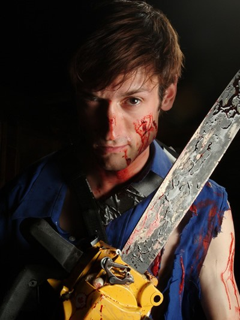
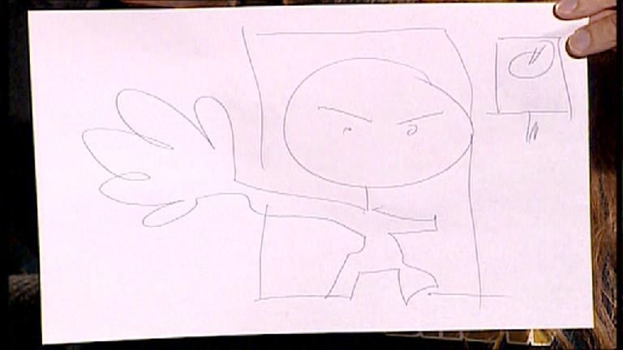
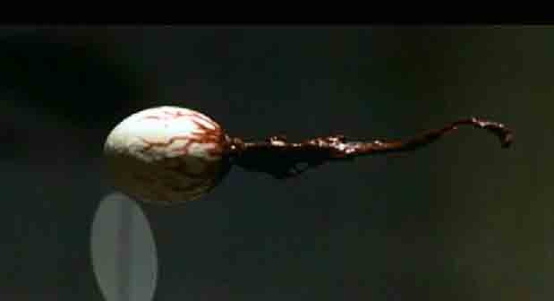

# Главное - у кого ружье!

> Я считаю, что мой главный долг — развлекать людей. Каждый новый фильм мне 
> хочется сделать немного другим... Речь идет не о профессиональном росте. Я
> говорю о том, что зрители постоянно хотят чего-то другого... Того, что пришло
> в наш мир не отсюда...
>
> *Сэм Рэйми*

Чтобы обрести популярность, фантастическая история вовсе не должна быть 
новой, умной и уж тем более вменяемой. Примеров тому множество. Скажем, 
постмодернисты занимаются высокохудожественным плагиатом и издаются
многотысячными тиражами, управление колобком, пожирающим таблетки в
лабиринте, называется «культовой игрой», а фильмы Дэвида Линча понимают лишь
маленькие зеленые гномики, живущие у него в волосах. Чтобы сделать
заурядность шедевром, нужно просто знать меру в эксцентричности, уметь
превращать банальности в неповторимый стиль и быть при этом гением.

27 лет назад братья Рэйми сотоварищи сделали нечто, за что им никогда не будет
стыдно, а конкурентам всегда будет мучительно больно. Слова «зловещие» и
«мертвецы» стали неотделимы друг от друга примерно так же, как «звездные» и
«войны». 20-летние американские подростки не просто качественно подурачились с
кинокамерой, но, сами о том не подозревая, создали целую вселенную ужаса.
Довольно забавную вселенную, надо сказать.

## Зловещая косология

|   |
|---|
||
|«Хлопушка» с рабочим названием первой части — «Книга мертвых».|

Термин «вселенная» может быть применен к фильмам ужасов лишь с некоторыми 
оговорками. Эта калька с английского universe по-русски звучит слишком 
астрономично, чтобы уживаться с волшебными и сверхъестественными сюжетами 
(пусть даже очень масштабными). Еще есть слово «мир», но употребить его в 
отношении историй, где пьют кровь и едят мозги, не смог бы даже самый 
закоренелый оптимист.

Мода называть подробно расписанные сюжеты «вселенными» появилась совсем 
недавно. Раньше никто бы и не задумывался о вселенной «Гостьи из будущего» или 
«Пикника на обочине». И даже сегодня сложно говорить об отдельных мирах 
«ужастиков». В 9 случаях из 10 все страшные истории происходят на фоне 
обыденной действительности. Их паранормальная составляющая объясняется «на 
пальцах», потусторонние измерения описываются как... «потусторонние измерения»,
а победа добра неизменно ведет к восстановлению «нормальности» окружающего
мира.

|   |
|---|
||
|Мы не можем похоронить Шелли! Она... она — наш друг!|

Бывают и исключения. Сюжеты о вампирах иногда уточняют историю и нравы
кровососов. Демонов можно назвать «кенобитами» и порадовать зрителей
обрывочными сведениями о «запредельном измерении неописуемых наслаждений».
Однако если речь идет об оживших мертвецах, дело совсем плохо. В лучшем случае
вину свалят на вирус, в худшем — на химическое оружие, а если и это не
поможет — на сценариста.

Рэйми не предполагал, что «Зловещие мертвецы» станут культовым фильмом. По
большому счету, он хотел просто развлечься. А в начале 1980-х особой
популярностью пользовались слэшеры (законодателем мод был «Хэллоуин») и
итальянские зомби-демонические «ужастики». Рэйми не стал изобретать велосипед,
и «Зловещие мертвецы» взяли низкий старт: пятеро студентов, заброшенный дом,
магическая книга и силы зла.

По сути, первых «Зловещих мертвецов» можно было бы причислить к жанру survival
horror с обратным отсчетом персонажей в духе «Чужого» (вышедшего двумя годами
ранее), ведь основным мотивом приключений Эша Вильямса была борьба за
выживание. Вторым, не менее важным персонажем этой истории стала «Мортуром
Демонто» — шумерская книга погребальных обрядов, известная как «Книга мертвых».

Проигрывание пленки с переводом ее заклинаний пробудило в лесах некое древнее
зло. Оно начинает овладевать подростками, превращая их в монстров. Эш — парень
не злой, однако изоляция в компании демонов и мертвецов — лучший стимул к
экспресс-обучению навыкам обращения с двустволкой и бензопилой.

|    |	
|----|
| |
|«Шумерский» язык книги мертвых и настоящая шумерская клинопись. Найдите 117 различий.|

## Первый блин

У Рэйми было всего 350 тысяч долларов на съемки, поэтому вместо аренды
павильона съемочная группа ездила в самый настоящий заброшенный домик близ
города Морристаун (штат Теннеси). Нельзя сказать, что съемки шли с трудом.
Когда Даль составлял свой словарь, это выражение еще не означало, что
85-минутный фильм будет сниматься четыре года, половина актеров уйдет из
проекта и их придется заменять другими. Чтобы зритель ничего не заметил, Рэйми
хитрил, как мог, — снимал со спины, издалека, в необычных ракурсах.

|   |
|---|
||
|Перекур (съемки «Зловещих мертвецов»).|

Не следует осуждать актеров за их малодушие. Платили им мало — и то лишь до тех
пор, пока деньги не кончились. На съемочной площадке Рэйми превращался в тирана.
Наконец, условия труда были, мягко говоря, спартанскими. К примеру, по вечерам
Брюса Кэмпбелла отвозили домой в кузове пикапа, так как к концу рабочего дня он
был покрыт смесью кукурузного сиропа и кетчупа (фальшивой кровью) с ног до
головы.

> ### Щас спою...
> В 2006 году композитор Кристофер Бонд и писатель Джордж Рейнблатт поставили в
> Канаде мюзикл «Зловещие мертвецы», одобренный Сэмом Рэйми и Брюсом
> Кэмпбеллом. Первые три ряда кресел составили так называемую «зону
> разбрызгивания». Билеты туда продавались с предупреждением о возможности
> промокнуть, а зрителям выдавали специальные накидки для защиты от потоков
> бутафорской крови, хлещущих со сцены. Некоторые фанаты «Зловещих мертвецов»
> специально надевали белые майки, чтобы они окрасились в красный цвет, и
> сохраняли их в память о мюзикле. Официальный сайт проекта —
> evildeadthemusical.com.
>
> |   |
> |---|
> | |
> |Роль Эша исполняет Райан Вард.|

По меркам своего времени фильм получился более чем кровавым. С прокатом
возникли трудности: в большинстве стран его запретили. А там, где разрешили —
вырезали все тошнотворные «вкусности». Но дело даже не в них! «Зловещие
мертвецы» разошлись по миру на видеокассетах со скоростью лесного пожара —
в основном потому, что они держали зрителя в постоянном напряжении.
	
|   |
|---|
||
|Когда актеры забывали, что делать, Рэйми спрашивал их — вы что, раскадровки не смотрели? Их рисовал он сам. Вот такие.|

Кровавая мясорубка была лишь приложением к великолепно смоделированной
ситуации: замкнутое пространство, опасность со всех сторон, смерть за каждым
углом и весьма смутные перспективы на спасение (Рэйми вдохновлялся «Ночью живых
мертвецов» и «Техасской резней бензопилой»). Кроме того, насилие в фильме было
явно напускным и балансировало на грани фарса, что слегка снижало градус
жестокости.

«Авторской вселенной» здесь пока еще и не пахло, но фильм выделялся среди
других любительских поделок виртуозной работой оператора. В качестве такового
выступал Рэйми, а орудовал он 16-миллиметровой камерой. Она была гораздо легче
35-миллиметровых, поэтому Сэм мог снимать такие сцены, которые списывали в
утиль прежние понятия о перспективе и ставили под сомнение законы гравитации.

> В фильме «Донни Дарко» титульный персонаж смотрит в кинотеатре «Зловещих
> мертвецов». Кроме того, фильм Рэйми упоминался в «Полтергейсте», «Кошмаре на
> улице Вязов 1 и 4», «Живой мертвечине» Питера Джексона, «Крике»,
> «Человеке-пауке», а также нескольких десятках других менее известных фильмов
> и игр.

|   |
|---|
||
|Фильм «Ловушка зловещих мертвецов» (Япония, 2001). Ничего общего с трилогией Рэйми.|

> ### Это интересно:
>
> * Заброшенный лесной домик из первых «Мертвецов» сгорел, однако если вы
>   свернете с Kidwell Ridge Road, то сможете найти уцелевший камин с трубой.
> * Лавкрафт утверждал, что слово «Некрономикон» он придумал во сне.
> * Слова, которые должен был произнести Эш в третьей серии (Клаата, Верада,
>   Никто), — отсылка к «Клаата, Барада, Никто» (команде для робота из фильма
>   «День, когда Земля замерла»).
> * Барахло в багажнике «Олдсмобиля» — не реквизит, а реальные вещи, которые
>   возил с собой Сэм Рэйми.
> * Выхлоп бензопилы имитировался табачным дымом. Тот подавался через шланг,
>   пропущенный через штанину Брюса.
>	
> |   |
> |---|
> ||
> |В 2008 году должен выйти фильм Брюса Кэмпбелла «Мое имя Брюс». Актера Кэмпбелла принимают за Эша, и ему приходится бороться со злом в реальном мире.|

## И вторые станут первыми!

Вторые «Зловещие мертвецы», о которых вы можете прочитать в описании нашего
DVD, стали наполовину римейком, наполовину продолжением первой части. Поняв,
что зрителей интересует не насилие как таковое, а манера его подачи, Рэйми
превратил фильм в черную комедию.

А началось все с того, что продюсер Дино де Лаурентис познакомился со Стивеном
Кингом и сделал его режиссером экранизации рассказа «Грузовики» (в прокате
фильм назывался «Максимальное ускорение», 1986). Продолжая разыгрывать карту
Кинга, де Лаурентис предложил Рэйми сделать театральную постановку «Худеющего»,
однако Сэм хотел снимать вторую часть «Зловещих мертвецов». Продюсера это не
интересовало — по крайней мере до тех пор, пока о планах Рэйми не узнал сам
Кинг. Писатель был фанатом первых «Мертвецов». Он сделал лишь один телефонный
звонок де Лаурентису — и прижимистый итальянец согласился дать Рэйми денег на
сиквел.

|   |
|---|
| |
|Перчатка Фредди Крюгера в сарае.|

Сэм запросил 4 миллиона. Ему дали на 400 тысяч меньше. Это незначительное на
первый взгляд обстоятельство полностью изменило судьбу «Зловещих мертвецов» и
самого Рэйми. Дело в том, что он планировал включить «средневековые
приключения» Эша во вторую часть с рабочим названием «Зловещие мертвецы 2:
Армия Тьмы». Но так как денег не хватило, средневековье приберегли для третьей
части, которая, в свою очередь, стала для Рэйми главным инструментом в
получении режиссерского кресла «Человека-паука».

|   |
|---|	
||
|Комикс «Фредди против Джейсона против Эша» (DC Comics, ноябрь 2007).|

Для работы над сценарием Рэйми пригласил своего школьного друга Скотта Шпигеля,
специализировавшегося на комедиях. Именно Скотт придумал зловещую руку (в
молодости Шпигель снял любительский фильм «Нападение руки»), эпизод с
бесконтрольным смехом Эша, а также внес лепту в некоторые скрытые шутки второго
плана — например, Шпигель предложил придавить накрытую ведром руку книгой
Хемингуэя «Прощай, оружие» (Farewell to Arms, игра слов: «Прощайте, руки!»).

|   |
|---|
||	
|Тед Рэйми с кислородной маской после дубля.|

Съемки этого фильма обросли легендами. Не потому, что на них происходила
какая-то чертовщина, а из-за того, что Рэйми часто экспериментировал, что
приводило к весьма курьезным ситуациям. Родного брата Теда (роль мертвой
Генриетты) он нарядил в костюм из латекса — настолько герметичный, что бедный
парень терял около килограмма веса за каждый день съемок. Когда ассистенты
раздевали его, из костюма выливалось 1-2 чашки пота. Обратите внимание на
сцену, когда Генриетта крутится вокруг головы Анны. Можно заметить, как из ее
уха капает пот.

|   |
|---|
||
|Глаза, затуманенные молоком.|

Иногда Сэм был жесток. Когда силы зла тащили Эша через лес, Рэйми спрятался за
кадром и изо всех сил хлестал своего лучшего друга ветвями. Эффект белых глаз,
придуманный им, достигался использованием молока и непрозрачных контактных
линз. Они выглядело эффектно, но лишали актеров возможности видеть. Им
приходилось репетировать сцену без грима — а потом надевать «белые» и играть
вслепую.

|   |
|---|
||	
|Родригез обожает «Зловещих мертвецов». Автомат на ноге Черри — дать уважения бензопиле на руке Эша.|

## Сотворение мира

Во второй части «Зловещие мертвецы» стали обрастать нюансами, характерными для
вымышленных вселенных. Шумерская «Книга мертвых» была переименована в
«Некрономикон» (Necronomicon Ex Mortis, что в переводе с греческого означает
нечто вроде «Образ закона мертвых»). Согласно творчеству Лавкрафта (а отсылка к
нему более чем очевидна), сей фолиант принадлежит перу сумасшедшего араба
Абдула Альхазреда (8 век нашей эры). В фильме же рассказывается, что книга
потерялась несколько тысяч лет назад, и демонстрируется короткая сцена ее
обнаружения профессором Рэймондом Кноби в какой-то непонятной гробнице.

|   |
|---|
||
|Фразу «книга из человеческой кожи» братья Рэйми понимают слишком буквально.|

|   |
|---|
| |
|За глазом видна направляющая спица. Сцена с его заглатыванием снималась в обратном порядке.|

Силы зла, действующие в фильме, именуются чем-то вроде «древней тьмы, живущей в
лесах», то есть получают мифическую привязку к деревьям. Не обошлось и без
финального «босса» — огромной зубастой головы демона, засасываемой во
временной портал. Последнее придает подвигам главного героя эпический масштаб —
оказывается, он упоминается в «Некрономиконе» как средневековый истребитель
нечисти.

Неожиданный финал а-ля «Назад в будущее» сулил темпоральные парадоксы,
волшебство и прочие атрибуты фэнтези. Рэйми сделал недвусмысленную заявку на
«углубление» истории, но до превращения «Зловещих мертвецов» в полноценную сагу
оставалось шесть лет.

|   |
|---|
||	
|В гриме злого Эша подбородок Кэмпбелла, и без того не маленький, был сильно увеличен.|

Упоминание о «Зловещих мертвецах 2» можно встретить в фильмах «Кошмар на улице
Вязов 5», «Клерки», «Блейд», «Мумия», «Сонная лощина» и неисчислимом количестве
других фантастических произведений.

## Армия поклонников

Обычно путешественники во времени отламывают носы сфинксам, крадут спортивные
альманахи, предотвращают убийства или становятся собственными отцами. Эш,
попавший в мрачное средневековье (medieval произносится, как mid-evil),
занимался примерно тем же. Ему пришлось отпиливать головы мертвецам, красть
«Некрономикон», постоянно предотвращать собственное убийство и породить злого
близнеца.

|   |
|---|
||	
|Злому Эшу полагаются рожки (съемки «Армии Тьмы»).|

«Армия Тьмы» была снята по мотивам «Янки из Коннектикута при дворе короля
Артура». Сценарий, написанный Брюсом Кэмпбеллом, Сэмом и Айваном Рэйми, занимал
лишь 43 страницы. Ребята решили распрощаться с надоевшим домиком в лесу. В
третьей части Эш должен был лишиться одного глаза, но потом его все же пожалели
и даже дали железную руку.

|   |
|---|
| |	
|В «Космической одиссее 2001» и в «Армии Тьмы» использовались схожие спецэффекты.|

Съемки проходили в Калифорнии. Для натуры использовался каньон Бронсон и
природный парк Vasquez Rocks — места, которые можно увидеть едва ли не в
каждом третьем голливудском фильме (например, здесь снимались сериалы «Бэтмен»
и «Звездный путь», фильмы «Царь скорпионов», «Планета обезьян» и даже ролики
для игры Prey). Спецэффекты делались с помощью фронтальной проекции — актер
играл перед экраном, на который проецировался задний фон (поток света был
слишком слабым, чтобы отразиться от человека). В 1990-х технология Introvision
считалась устаревшей (по ней снимались еще «Космическая одиссея 2001» и
«Супермен»), однако Рэйми настоял на ней, считая эффекты фронтальной проекции
более «живыми».

|   |
|---|
||	
|В оригинале Эш перебарщивает с сонными каплями и просыпается в постапокалиптическом будущем.|

Как обычно, Сэм решил помучить Брюса и заказал хореографам самые сложные боевые
сцены. В один из 100 съемочных дней Кэмпбеллу пришлось сделать 37 дублей одной
и той же сцены; словарный запас съемочной группы в тот день обогатился многими
презанятными выражениями. Реквизиторы построили в пустыне средневековый замок,
и Сэм гонял по нему актеров от полудня (в самую жару) до позднего вечера (когда
столбик термометра опускался до нуля).

В свою очередь, режиссер изрядно потрепал себе нервы при монтаже. А виноват в
этом был... Ганнибал Лектер. Дино де Лаурентис не хотел отдавать студии
Universal права на съемку продолжения «Молчания ягнят», поэтому голливудские
воротилы решили отыграться на «Армии Тьмы». Они заставили Рэйми переснять
«слишком мрачную» концовку, отказали ему в выделении денег на послесъемочную
доработку фильма, отложили премьеру на полгода и вырезали почти 10 минут из
финальной версии, чтобы снизить возрастной рейтинг с NC-17 до R.

|   |
|---|
||	
|Постельная сцена из «Армии Тьмы» была вырезана.|

Несмотря ни на что, «Армия Тьмы» имела бешеный успех. Ее растащили на цитаты,
примерно как фильмы Гайдая. «Hail to the king, baby!», говорил Дюк Нюкем. Калеб
из игры Blood и некромант из Elder Scrolls 4 изрекают: «I live... again!», а
стрелок из Warcraft 3 хвастается: «This is my boomstick!». Брюс Кэмпбелл
вспоминал, что одно время ему приходили письма с благодарностями от парней,
наладивших взаимоотношения с девушками коронной фразой «Give me some sugar,
baby!».

Третий фильм почти полностью отошел от жанра «ужасов». Пугающих моментов как
таковых в нем нет. Мертвецы получили официальное название «deadites» (нечто
вроде «мертвяки»). Конструкция сюжета позволяет сделать вывод, что Эш стал
невольным виновником апокалипсиса. Включив магнитофон в лесном доме, он не
только вызвал мертвяков в наш мир и не только стал важной исторической фигурой,
упомянутой в «Некрономиконе», но и каким-то образом обрек человечество на
постоянную войну с силами зла — ведь по возвращении в супермаркет S-Mart конца
20 века ему вновь пришлось взяться за «громовую палку».

|   |
|---|
| )|	
|Комиксы по мотивам «Зловещих мертвецов» от Dark Horse Comics и Dynamite Entertainment.|

> Первая игра «Зловещие мертвецы» вышла в 1984 году для Commodore 64 и ZX
> Spectrum. После долгой паузы в 2000 вышла «Evil Dead: Hail to the King» для
> PC и консолей. В 2003 вышла «Evil Dead: A Fistful of Broomstick» (Xbox, PS2),
> а в 2005 — «Evil Dead: Regeneration» (PC и почти все консоли).
>
>    

----

Цикл «Зловещие мертвецы» очень похож на игры серии Doom. Фильмы удачно
объединили совершенно полярные явления. Id Software скрестила ужасы с научной
фантастикой, а Рэйми сумел впрячь в одну телегу конский юмор и трепетный
хоррор.

Вселенная «Зловещих мертвецов» — это не мир с дурацкими названиями на
несуществующем языке, не калька с древних мифов и даже не комиксы про
какого-нибудь неудачника, случайно получившего суперспособности. Это три
фильма, окруженные легендами, торговая марка с многомиллионным оборотом
произведений «по мотивам», фанаты, конвенты и безумная надежда на то, что
когда-нибудь Рэйми возьмется за старое.

В данной вселенной правит бал «Некрономикон». Неважно, как его читать —
правильно (как в первых двух фильмах), или с ошибками (как в третьей части), он
все равно оживит мертвецов. И тогда уже будет наплевать на то, что у
вымышленного мира нет карты, а персонажи умирают с энтузиазмом самцов богомола.
Главное — у кого в тот момент окажется ружье.

|   |
|---|
||
|Комикс «Зомби Марвел против Армии Тьмы» (Marvel Comics). Эш борется с зомбированными супергероями Marvel.|
